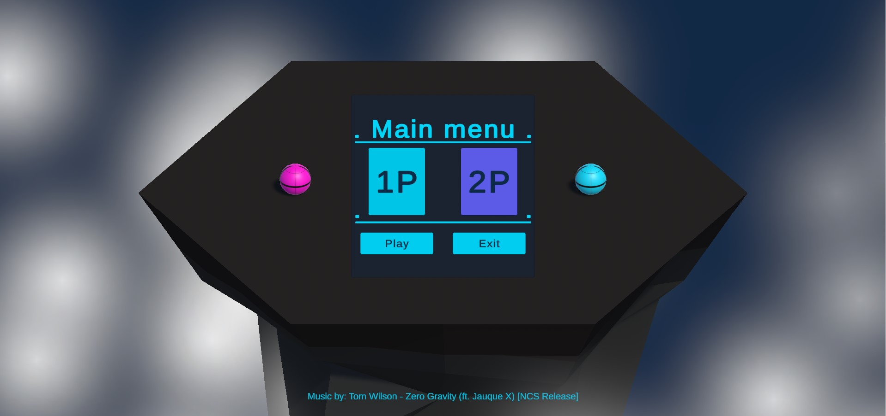

# Prototype 4 (Unity 6)



**Prototype 4** is an action two player Unity game prototype developed as part of the **Unity Junior Programmer Pathway (Unity 6)**.  
It features enhanced gameplay mechanics including player moving(using rigidbody), enemies, powerups, UI interaction, and simple game logic.


---

## ▶️ Play Demo

- [🎮 Unity Play Demo](https://play.unity.com/en/games/db51c94f-1566-4b02-b37a-ff4d267544cc/prototype3) 
- [🌐 itch.io Demo](https://https://faez-mahmoudi.itch.io/prototype3)


## ▶️ Gameplay Video

- [Watch Gameplay Video](Videos/Prototype4_Unity6_V1.mp4)

---


## 🧠 About

This project demonstrates core Unity skills such as:

- Player jump using rigidbody
- Creating new obstacle prefabs
- Collision detection and particle system
- UI elements (game over panel, score cornometer, dollars , and bombs)
- Simple game logic and state management

The goal of this prototype is to practice basic interactive game mechanics using Unity and C#.

---

## 🚀 Features

✔ Smooth player movement and jump  
✔ Items pickup and new score system  
✔ Dollar and bomb tracking  
✔ UI panels for game over and pause    
✔ Particle system for explosions   
✔ Animation for player movment, jump, and die    
✔ Playable WebGL build    

---

## 🎮 How to Play

- **F** → Fire bomb   
- **Collect items** to gain temporary abilities for destroying obstacles 
- **Collect dollars** to have chance to continue
- **Space Key** → Jump(double jump)  
- Avoid obstacles and black bombs to survive  

---

## 📦 Getting Started

### 🔹 Clone the repository
```bash
git clone https://github.com/Faez-Mahmoudi/Prototype4_Unity6.git
